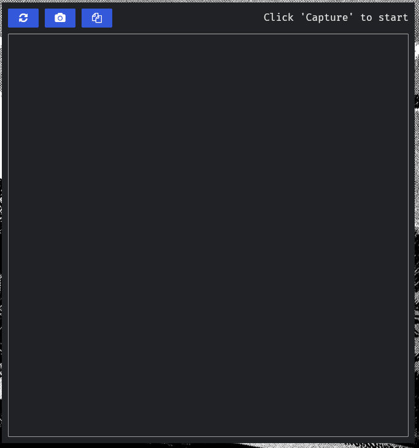
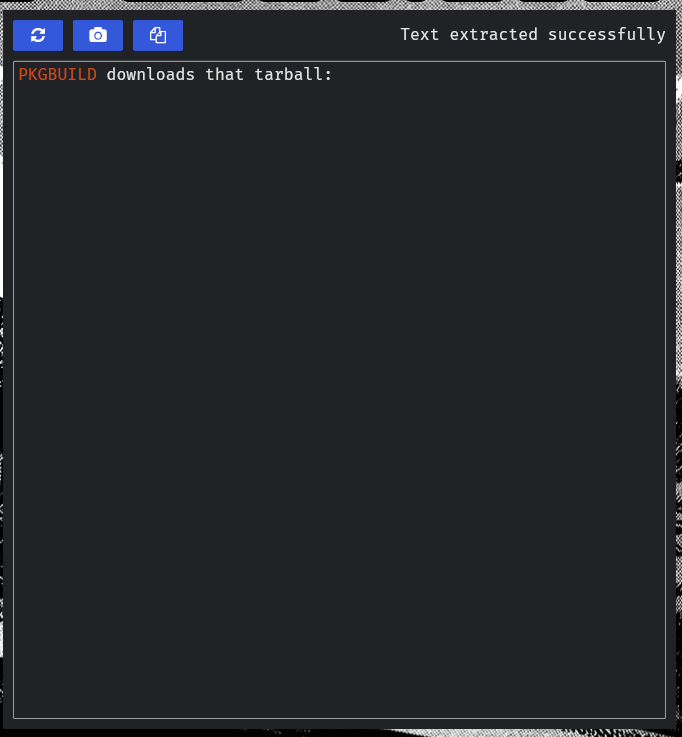

# 🧩 MonteCapcho — Screen OCR for Linux

<table>
  <tr>
    <td></td>
    <td></td>
  </tr>
</table>

MonteCapcho lets you draw a region on your screen and instantly extract the text from it — no internet required. Works on both Wayland and X11.

Built with **Rust**, **Iced**, and **Tesseract OCR**.

---

## ✨ Features

- Draw a region → extract text in one step
- Fully offline — nothing leaves your machine
- Works on Wayland (`grim` + `slurp`) and X11 (`maim` + `slop`)
- Simple GUI with an editable text area
- CLI mode for scripting and terminal workflows
- One-click clipboard copy

**Coming soon:**
- High-accuracy mode via PaddleOCR
- Code-aware OCR
- Image preprocessing pipeline
- Improved dark background OCR

---

## 📦 Installation

### Arch Linux — AUR (recommended)

```bash
yay -S montecapcho
```

Or manually with the PKGBUILD:

```bash
git clone https://aur.archlinux.org/montecapcho.git
cd montecapcho
makepkg -si
```

### Build from source

Requires Rust toolchain (1.82+), Tesseract, and Leptonica installed.

```bash
git clone https://github.com/Top-g-hash/Monte-Capcho
cd Monte-Capcho
cargo build --release
./target/release/MonteCapcho
```

---

## 🛠 Dependencies

These are installed automatically via the AUR package. If building from source, install them manually:

**Common (both Wayland and X11):**

| Package | Purpose |
|---|---|
| `tesseract` | OCR engine |
| `leptonica` | Image processing library |
| `copyq` | Clipboard persistence |

> **Note:** `copyq` is not installed by default on most distros. Install it via your package manager:
> ```bash
> # Arch
> sudo pacman -S copyq
>
> # Debian/Ubuntu
> sudo apt install copyq
> ```
> Without it, the copy-to-clipboard feature will not work.

**Wayland only:**

| Package | Purpose |
|---|---|
| `grim` | Screenshot tool |
| `slurp` | Region selection |

**X11 only:**

| Package | Purpose |
|---|---|
| `maim` | Screenshot tool |
| `slop` | Region selection |

---

## 🚀 Usage

### GUI mode

```bash
MonteCapcho
```

The GUI gives you an editable text area, a capture button, and a copy button.

| Shortcut | Action |
|---|---|
| `Ctrl+S` | Capture region and extract text |
| `Ctrl+C` | Copy extracted text to clipboard |

### CLI mode

Capture and print text to stdout:

```bash
MonteCapcho --capture
```

Capture and copy directly to clipboard:

```bash
MonteCapcho --capture --copy
```

**Flags:**

| Flag | Description |
|---|---|
| `-c` / `--capture` | Perform screenshot + OCR |
| `-p` / `--copy` | Copy output text to clipboard |

---

## 📁 Project Structure

```
src/         → Application source code
fonts/       → Embedded font assets
assets/      → Icons and .desktop file
Cargo.toml   → Rust project config
build.rs     → Build scripts (font embedding)
```

---

## 📜 License

Licensed under the [MIT License](LICENSE).

---

## 👏 Acknowledgments

- [Iced](https://github.com/iced-rs/iced) — GUI framework
- [Tesseract OCR](https://github.com/tesseract-ocr/tesseract) — text recognition
- [CopyQ](https://hluk.github.io/CopyQ/) — clipboard manager
- [clap](https://github.com/clap-rs/clap) — CLI argument parsing

---

## 💬 Contributing

Contributions are welcome — bugs, features, or improvements.

1. Fork the repo
2. Create a branch (`git checkout -b feature/my-feature`)
3. Commit your changes
4. Open a pull request

Report issues at: [github.com/Top-g-hash/Monte-Capcho/issues](https://github.com/Top-g-hash/Monte-Capcho/issues)
